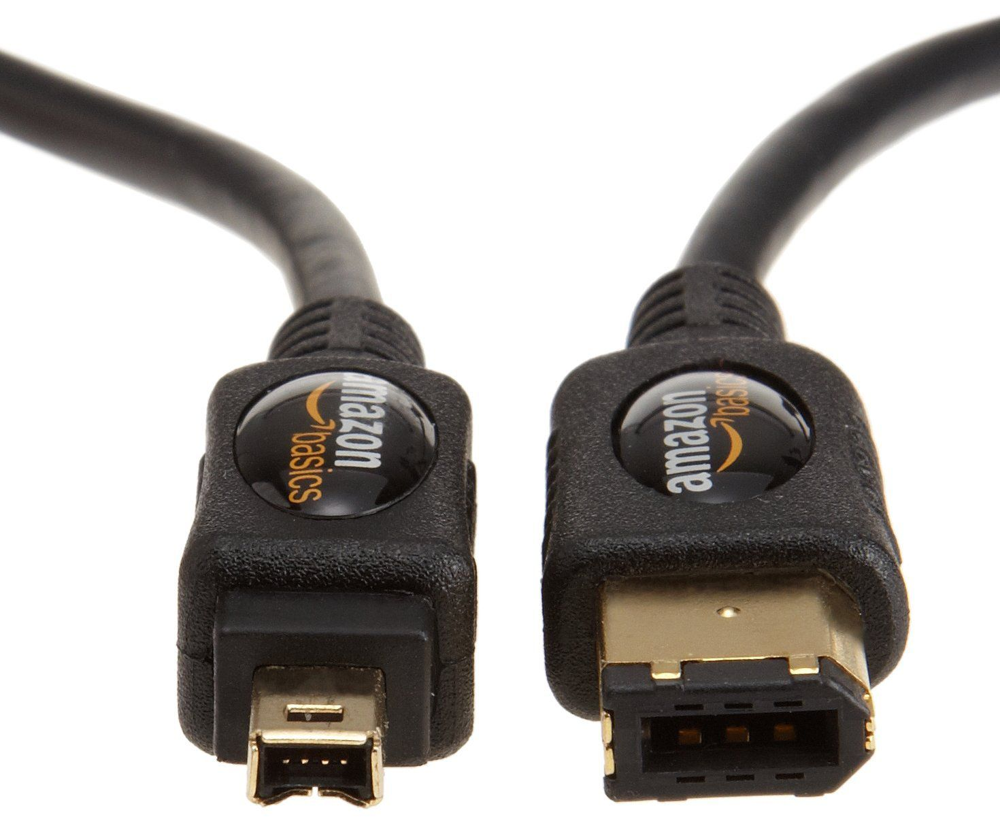
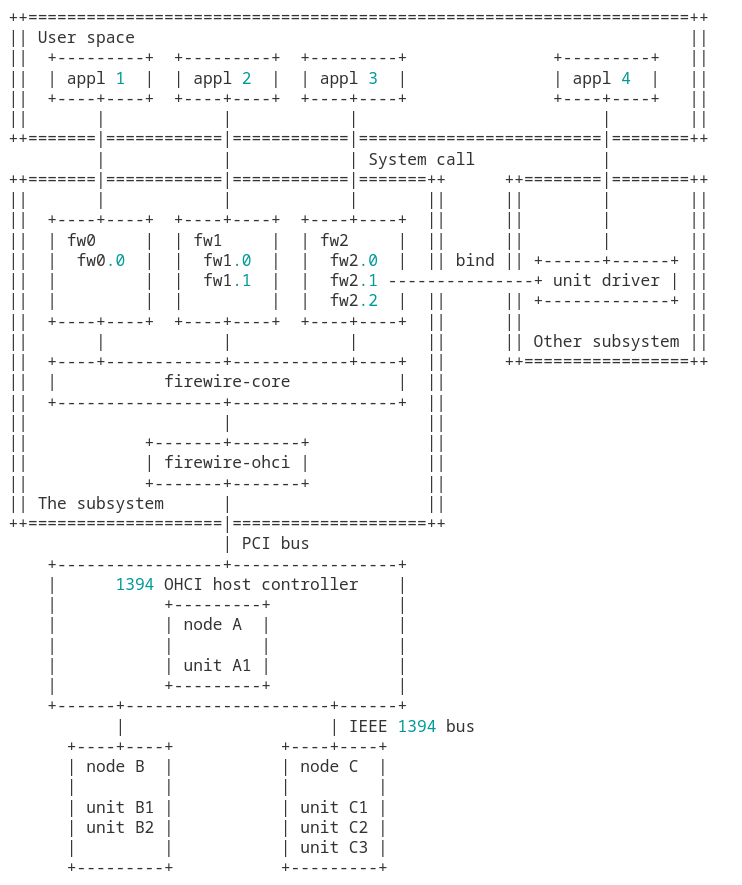
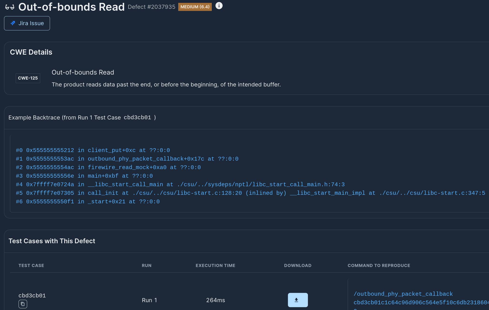
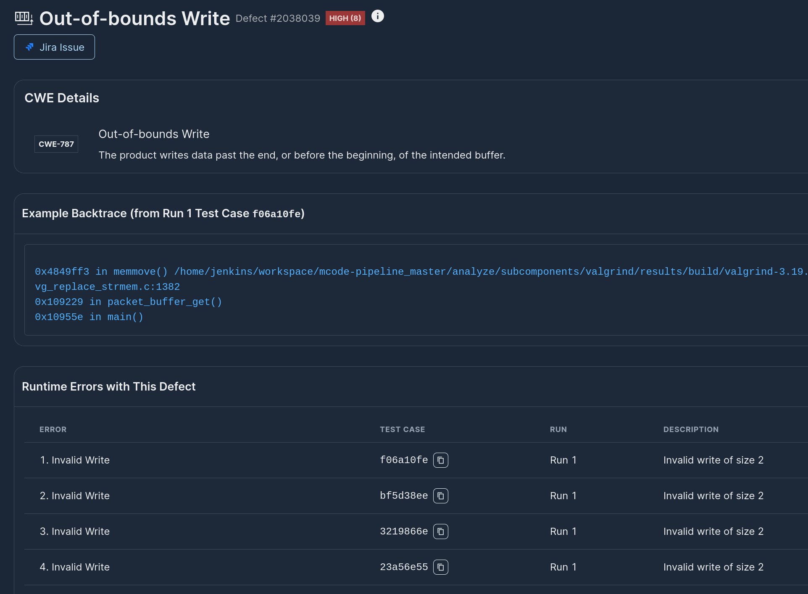

# Playing with FireWire (IEEE 1394) - CVE-2023-3159 and CVE-2024-27401



In this blog post, we're going to be taking a look at the security of FireWire driver implementations in Linux and demonstrating how kernel subsystems can be harnessed and tested in userspace using Mayhem with minimal effort. During our testing, we were able to reproduce [CVE-2023-3159](https://nvd.nist.gov/vuln/detail/CVE-2023-3159) and found a new CVE [CVE-2024-27401](https://nvd.nist.gov/vuln/detail/CVE-2024-27401).

## What is FireWire?

FireWire, also known as IEEE 1394, is a serial bus interface standard that revolutionized high-speed communications and isochronous real-time data transfer when it was introduced by Apple in the late 1980s and standardized by the IEEE in 1995. Designed to simplify the chaotic sea of cables behind computers, FireWire simplified hardware configurations with its plug-and-play capabilities, supporting speeds from 400 Mbps to 3.2 Gbps in subsequent versions. This interface can connect up to 63 devices through a tree or daisy-chain topology, and its dual capability for transferring both data and multimedia content made it key for video and audio applications. Whether it's for digital video cameras or professional audio gear, FireWire has been used extensively for efficient, high-speed data transfers.



FireWire has been supported in the Linux kernel since the early 2000s (2.6.12), with a switch to the [newer stack after 2.6.3x](http://ieee1394.docs.kernel.org) around 2010. Nowadays, IEEE 1394 is considered legacy, but kernel security vulnerabilities continue to come up and affect embedded developers and security teams worldwide maintaining solutions that rely on the FireWire interface. It is worth nothing that all kernel issues identified are *on top* of all other vulnerabilities that teams have to worry about within their own app-specific codebase. Kernel vulnerabilities are typically highest-priority because they can allow attackers to gain complete control over a system independently of other system software or defense mechanisms.

In the past, multiple vulnerabilities have been found in the use of FireWire, including the Linux kernel - for example, [CVE-2023-3159](https://nvd.nist.gov/vuln/detail/CVE-2023-3159). However, there may be more bugs lurking in the code and we thought we'd take a quick look.

## First hurdle: driver code lives and runs in kernel space

FireWire for Linux currently lives under [drivers](https://github.com/torvalds/linux/tree/master/drivers/firewire) and consists of several modules that expect to be running in kernel space. This typically presents developers with a challenge, both in terms of development but also testing. Kernel setup is typically more involved/slow than a "compile and test" cycle for user space applications. There exist solutions like [syzkaller](https://en.wikipedia.org/wiki/Syzkaller) that allow for fuzzing system calls, but the hypothesis we wanted to test in this write up is whether we can actually get a fast "compile and test" cycle in user space (spoiler: in some cases we can!).

## Extracting functions and mocking

To test our hypothesis, we decided to start with an example. [CVE-2023-3159](https://nvd.nist.gov/vuln/detail/CVE-2023-3159) looked like a reasonable candidate, a use-after-free vulnerability within the `core-cdev.c` module. Could we find this vulnerability automatically?

The answer is probably yes, but how hard is it? Let's put it to the test! We checked out the [core-cdev.c module before the fix](https://github.com/torvalds/linux/blob/ebe4560ed5c8cbfe3759f16c23ca5a6df090c6b5/drivers/firewire/core-cdev.c) and our goal is to test the main syscall entrypoint within the module, i.e., function `outbound_phy_packet_callback`. Ideally, we'd like to test it as a single unit, i.e., compile and test this specific function without requiring the rest of the build process.

In a way, what we need is a [program slice](https://en.wikipedia.org/wiki/Program_slicing) of the kernel driver, specifically around the function entrypoint. At first sight, it seems challenging, program slicing is hard. We decided to try it out however, and as our first step, we extracted the function and put it in its own file [outbound_phy_packet_callback_function.c](./outbound_phy_packet_callback_function.c). Naturally, that won't compile at all, since every called function and used datastructure is missing.

At this point, we would probably have to identify every called function and bring them in along with all datastructure definitions to mock the dependencies of the function. At this point, we decided to cheat a bit in our effort and used an LLM-backed script to help us get some sample mocks off the ground (note: there is a very large number of ways to accomplish something like that, we chose to use LLMs just to give it a try :)):

```bash
(venv) $ python3 automock.py
#include <stddef.h>

#define container_of(ptr, type, member) ({			\
	const __typeof__(((type *)0)->member) * __mptr = (ptr);	\
	(type *)((char *)__mptr - offsetof(type, member)); })

#define ACK_COMPLETE 1
#define ACK_PENDING 2
#define ACK_BUSY_X 3
#define ACK_BUSY_A 4
#define ACK_BUSY_B 5
#define ACK_DATA_ERROR 6
#define ACK_TYPE_ERROR 7

...

struct fw_packet {
	int timestamp;
};

...

void outbound_phy_packet_callback(struct fw_packet *packet, struct fw_card *card, int status) {
	struct outbound_phy_packet_event *e = container_of(packet, struct outbound_phy_packet_event, phy_packet);
...
```

The resulting code still had some errors but extracted all the key datastructures and put together the prototypes of the functions we needed to get `outbound_phy_packet_callback` to run. Beyond datastructures, we also added a couple of conditionals to mock failures - for instance, what happens when queue_event fails. After 5 minutes of tidying up, we were able to get a target that is fully compilable:

```c
gcc -c outbound_phy_packet_callback outbound_phy_packet_callback.c
```

## Second hurdle: our target function does not read from file or stdin

Mayhem has built-in support for testing code with [all standard input sources](https://docs.mayhem.security/code-testing/tutorials/advanced/target-inputs/) (files, TCP, UDP, unix sockets and so on) - more than any other solution out there - but its still not immediately clear how to test our function that does not interact with any of the above input sources. Instead our function expects data through its input parameters `packet`, `card` and `status`. Is there a way to bridge this gap?

There are at least two standard ways to handle this in the literature: (1) through a [FuzzedDataProvider](https://github.com/google/fuzzing/blob/master/docs/split-inputs.md) (FDP) approach where we read bytes from an input source and then feed them into the datastructures the target function expects, and (2) we define a protobuf for structs consumed by the function and then test the interface with [libprotobuf-mutator](https://github.com/google/libprotobuf-mutator) (LPM). Here we decided to use the FDP method, since the interface of the function is straightforward and be sufficient for our test. (We do plan to look into LPM examples in the future.)

Building a layer to get the FDP method to convert file input bytes to function arguments is only a few lines of code:

```
void firewire_read_mock(uint8_t *data, size_t size) {

	freed = false;
	int status;
	// initialize the status variable
	consume(&status, data, sizeof(status), &size);

	// initialize the client
	struct client * client = malloc(sizeof(struct client));
	consume(client, data, sizeof(struct client), &size);

	// initialize the event
	struct outbound_phy_packet_event * event = malloc(sizeof(struct outbound_phy_packet_event));
	consume(event, data, sizeof(struct outbound_phy_packet_event), &size);
	event->client = client;

	// call the function we want to fuzz
	outbound_phy_packet_callback(&event->p, NULL, status);
	if (!freed) free(event);
	free(client);
}
```

## Easy: Build and Mayhem Run!

Next, let's get our target up and running! The full contents of what we are trying to test are in [outbound_phy_packet_callback.c](./outbound_phy_packet_callback.c). Writing a Dockerfile for it is trivial (and super fast to build):

```dockerfile
# Base image to build targets
FROM debian:latest as builder

RUN apt update && apt install -fy gcc
COPY outbound_phy_packet_callback.c .
RUN gcc -o /outbound_phy_packet_callback outbound_phy_packet_callback.c

# First target: the outbound physical packet callback
FROM debian:latest as outbound-phy-packet-callback

# Install libc6-dbg to enable advanced triage
RUN apt update && apt install -fy libc6-dbg

COPY  --from=builder /outbound_phy_packet_callback /outbound_phy_packet_callback

ENTRYPOINT []
CMD ["/outbound_phy_packet_callback", "@@"]
```

Next, we put together a quick Mayhemfile:

```yaml
project: firewire
target: outbound-phy-packet-callback-1
image: ethan42/firewire:outbound-phy-packet-callback-1
advanced_triage: true
cmds:
  - cmd: /outbound_phy_packet_callback @@
```

And let's fire up Mayhem:

```bash
$ docker build -t ethan42/firewire:outbound-phy-packet-callback-1 --target=outbound-phy-packet-callback .
[+] Building 0.1s (11/11) FINISHED                                                                                        docker:default
...
sha256:3331b4abdccbe780f02cb85287c591b6101f9f4ce614c82b851ab0bf84dd0eaf                                        0.0s
 => => naming to docker.io/ethan42/firewire:outbound-phy-packet-callback-1
$ docker push ethan42/firewire:outbound-phy-packet-callback-1
$ mayhem run . -f outbound_phy_packet_callback.mayhem
/tmp/tmp3yizhtdi/Mayhemfile 100% |############################################################################| Time:  0:00:00 423.0 B/s
Run started: firewire/outbound-phy-packet-callback-2/1
Run URL: https://app.mayhem.security:443/ethan42/firewire/outbound-phy-packet-callback-1/1
firewire/outbound-phy-packet-callback-1/1
```

Within seconds, Mayhem comes back with the finding:



Downloading locally and trying it out with valgrind immediately repros the issue:

```$ valgrind --tool=memcheck ./outbound_phy_packet_callback cbd3cb01c1c64c96d906c564e5f10c6db231860437387f3b1fcb31e8bce70c80
==90372== Memcheck, a memory error detector
==90372== Copyright (C) 2002-2022, and GNU GPL'd, by Julian Seward et al.
==90372== Using Valgrind-3.19.0 and LibVEX; rerun with -h for copyright info
==90372== Command: ./outbound_phy_packet_callback cbd3cb01c1c64c96d906c564e5f10c6db231860437387f3b1fcb31e8bce70c80
==90372==
Freed
==90372== Invalid read of size 8
==90372==    at 0x1093BF: outbound_phy_packet_callback (in /home/ethan/github/ethan42/linux-ieee1394/outbound_phy_packet_callback)
==90372==    by 0x1094CA: firewire_read_mock (in /home/ethan/github/ethan42/linux-ieee1394/outbound_phy_packet_callback)
==90372==    by 0x109589: main (in /home/ethan/github/ethan42/linux-ieee1394/outbound_phy_packet_callback)
==90372==  Address 0x4a51438 is 8 bytes inside a block of size 48 free'd
==90372==    at 0x484317B: free (vg_replace_malloc.c:872)
==90372==    by 0x109212: queue_event (in /home/ethan/github/ethan42/linux-ieee1394/outbound_phy_packet_callback)
==90372==    by 0x10934D: outbound_phy_packet_callback (in /home/ethan/github/ethan42/linux-ieee1394/outbound_phy_packet_callback)
==90372==    by 0x1094CA: firewire_read_mock (in /home/ethan/github/ethan42/linux-ieee1394/outbound_phy_packet_callback)
==90372==    by 0x109589: main (in /home/ethan/github/ethan42/linux-ieee1394/outbound_phy_packet_callback)
==90372==  Block was alloc'd at
==90372==    at 0x48407B4: malloc (vg_replace_malloc.c:381)
==90372==    by 0x10948A: firewire_read_mock (in /home/ethan/github/ethan42/linux-ieee1394/outbound_phy_packet_callback)
==90372==    by 0x109589: main (in /home/ethan/github/ethan42/linux-ieee1394/outbound_phy_packet_callback)
==90372==

```

A quick check shows that that the issue is exactly the one that was later on [fixed in main](https://github.com/torvalds/linux/commit/b7c81f80246fac44077166f3e07103affe6db8ff) where the client structure was used after being freed. Applying the patchset resolves the issue.

## Being nosy - Finding CVE-2024-27401 in < 30 seconds

Reproducing an existing vulnerability validated that this extract, build and test on single functions is feasible (we had at least one example to prove that!) and thought about trying it on another one. Scanning the codebase, we found [nosy.c](https://github.com/torvalds/linux/blob/master/drivers/firewire/nosy.c), a snoop mode driver for 1394 controllers that can also read adversarial packets and gave that a try.

Following the same methodology, we extracted the main entrypoint invoked by `nosy_read`: `packet_buffer_get` and again mocked all the environment, calls and datastructures. The resulting file was [packet_buffer_get.c](./packet_buffer_get.c). After Dockerizing the target, we put together a short Mayhemfile:

```yaml
project: firewire
target: packet-buffer-get-1
image: ethan42/firewire:packet-buffer-get-1
advanced_triage: true
cmds:
  - cmd: /packet_buffer_get @@
```

And then fired up Mayhem:

```bash
$ docker build -t ethan42/firewire:packet-buffer-get-1 --target=packet-buffer-get .
[+] Building 0.6s (13/13) FINISHED                                                                                        docker:default
...
 => => naming to docker.io/ethan42/firewire:packet-buffer-get-1                                                                     0.0s
$ docker push ethan42/firewire:packet-buffer-get-1
The push refers to repository [docker.io/ethan42/firewire]
...
1a5fc1184c48: Layer already exists
packet-buffer-get-1: digest: sha256:0cc7cbac32a3276cd3ad00d343828bbb9737bb4704172c07394eecab68e885a9 size: 949
$ mayhem run . -f packet_buffer_get.mayhem
/tmp/tmp144o0u51/testsuite.tgz 100% |#########################################################################| Time:  0:00:00 457.1 B/s
Syncing /tmp/tmphrltzlkv 100% |#########################################################################################| Time:  0:00:01
Run started: firewire/packet-buffer-get-1/1
Run URL: https://app.mayhem.security:443/ethan42/firewire/packet-buffer-get-1/1
firewire/packet-buffer-get-1/1
```

Again, within 30 seconds we get another finding, this time claiming its an arbitrary write(!):



At first thought, we were certain this is wrong and something must be off with the harness we put together. However, after downloading the test case and reproducing locally, we observe that the issue comes from the following lines of code:

```c
static int
packet_buffer_get(struct client *client, char *data, size_t user_length)
{
...
	/* FIXME: Check length <= user_length. */

	end = buffer->data + buffer->capacity;
	length = buffer->head->length;

	if (&buffer->head->data[length] < end) {
		if (memcpy(data, buffer->head->data, length))
			return -EFAULT;

```

The FIXME makes it pretty clear here, we're missing the length check when we're copying data back to the user buffer! A bug like that may not affect the kernel space, but there may definitely be user space applications that would be surprised if somehow the user length specified was not respected.

We raised the issue to the maintainers and within hours we had a response and after a couple of email exchanges we had a [patch shipped to main](https://github.com/torvalds/linux/commit/38762a0763c10c24a4915feee722d7aa6e73eb98) and a CVE assigned ([CVE-2024-27401](https://nvd.nist.gov/vuln/detail/CVE-2024-27401)). Once again, I was impressed with the agility the Linux team showed with handling security reports.

In the future, we may look again into firewire targets, but that's all for now! We got a CVE repro and a fresh finding with just a few seconds of Mayhem - not bad at all :)
